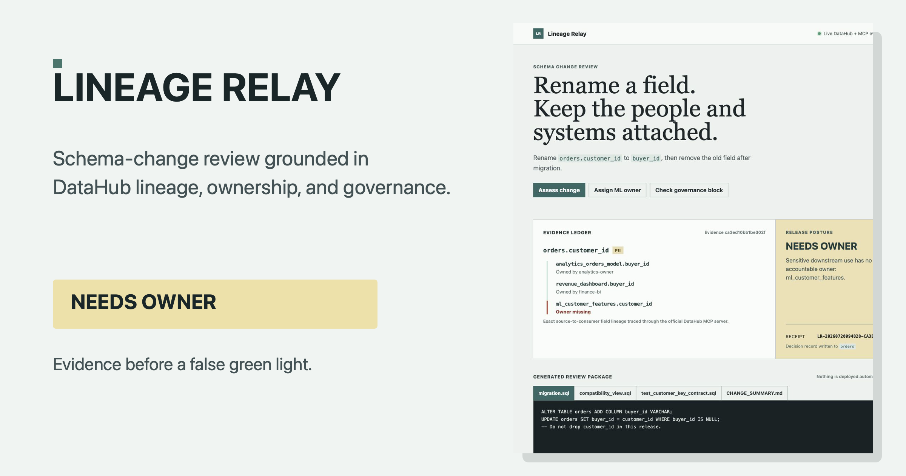

# Lineage Relay

Lineage Relay turns a schema-change request into a reviewable release package
grounded in a live DataHub metadata graph and verified by the official DataHub
MCP server.



Data teams usually discover that a harmless-looking column rename had a human
owner, an ML feature, or a dashboard attached only after something breaks.
Lineage Relay makes the consequence visible before release: exact field paths,
accountable owners, a deterministic release posture, and a review package. It
is not a generic coding assistant and it never deploys a migration.

The first proof asks to rename `orders.customer_id` to `buyer_id`. The app reads
the source schema, ownership, and sensitivity metadata from a synthetic local
DataHub instance. It then asks DataHub MCP to trace three exact column paths:
source to analytics, analytics to dashboard, and source to ML features. It
returns one deterministic posture:

- `NEEDS_OWNER` when sensitive downstream use has no accountable owner.
- `READY` when owners and compatibility actions are present.
- `BLOCKED_BY_GOVERNANCE` when a removal rule blocks the request.

It generates a migration, compatibility view, contract test, and change summary
for review. It never runs the migration. Each review writes a receipt back to
the source asset as DataHub custom properties.

## Hackathon fit

Lineage Relay is built for DataHub's **Metadata-Aware Code Generation &
Development** category. It does not generate a migration from a prompt alone:
it first reads the affected field's schema, field-level lineage, ownership, and
governance context through DataHub MCP. The resulting package is code a data
team can review in a pull request: a migration, compatibility view, contract
test, and change summary. The sample output below lets judges inspect that
package before starting the lab.

## Sample review package

Judges can inspect the generated `NEEDS_OWNER` package without starting the
lab in [`examples/needs-owner/`](examples/needs-owner/). The package keeps the
legacy column in place and makes the ownership gap explicit; it is review
material, not an automatically applied migration.

## Run the proof locally

The repository contains the complete public-safe fixture. It requires Python
3.11+, Docker, and a local clone of the official DataHub MCP server.

```bash
git clone https://github.com/Peanuts1605/lineage-relay.git
cd lineage-relay
python3.11 -m venv .venv
. .venv/bin/activate
pip install -r requirements.txt

# Start a local DataHub OSS instance, then wait for http://localhost:8080.
datahub docker quickstart

# Use the official MCP server implementation for the field-level evidence.
git clone https://github.com/acryldata/mcp-server-datahub.git ../mcp-server-datahub
pip install -e ../mcp-server-datahub

export DATAHUB_GMS_URL=http://localhost:8080
export LINEAGE_RELAY_MCP_PYTHON="$PWD/.venv/bin/python"
export LINEAGE_RELAY_MCP_SOURCE_ROOT="$PWD/../mcp-server-datahub/src"
python scripts/seed_lineage_relay_fixture.py
./scripts/start-forge-demo.sh
```

Open `http://127.0.0.1:4176`. The fixture creates only synthetic datasets and
metadata. It is safe to reset by rerunning the seed script.

The MCP server runs with its mutation tools disabled. It provides the field-level
proof; the app writes only its receipt properties through the DataHub SDK.

## Judge check in one minute

1. Open the seeded `NEEDS_OWNER` review: the ML feature uses PII and has no
   owner, while the DataHub MCP trace confirms all three column paths.
2. Select **Assign ML owner**: the synthetic owner is written to DataHub and the
   same evidence produces `READY` plus a migration package.
3. Select **Check governance block**: the active removal rule yields
   `BLOCKED_BY_GOVERNANCE` and no migration artifact.
4. Every decision leaves a receipt and evidence hash on `orders` in DataHub.

## Demo evidence

The repository includes a 49.9-second working-state walkthrough in
[`demo/video/lineage-relay-forge-walkthrough-draft.mp4`](demo/video/lineage-relay-forge-walkthrough-draft.mp4).
Its three captured states and capture notes are documented in
[`demo/`](demo/).

The wide project cover used for the submission is in
[`demo/submission/`](demo/submission/). It is assembled from the live
`NEEDS_OWNER` review state, not a conceptual mockup.

## Test

```bash
python -m pytest tests -q
```
