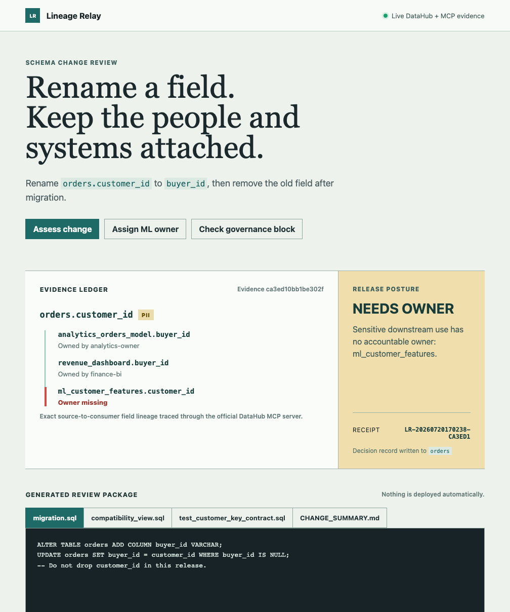

# Lineage Relay Portrait Demo Readability Patch

- Owner: `ORION_L`
- Date: `2026-07-20`
- Decision: `PASS_WITH_PATCH`
- Source commit: `2763be5f2d5075872e5b4ab9c70958aabf9f90a0`

## Finding

The submitted portrait walkthrough used a 1008 x 1208 viewport. Its long
receipt identifier was an unbreakable flex item, so the live release panel
could force horizontal overflow and crop the right edge of the decision state.
That made the most important proof less legible than the product deserved.

## Patch

- Allow receipt children to shrink inside the decision panel.
- Allow long receipt IDs to wrap at safe break points and align right.
- Bump the stylesheet cache version so the changed layout reaches the Forge
  review route without a stale CSS response.

No decision logic, DataHub request, MCP evidence, fixture, or generated
artifact changed.

## Validation

- `python -m pytest tests -q`: `6 passed`.
- Source diff check: passed.
- The public GitHub source was updated in commit `2763be5`.
- The Forge review route at `http://127.0.0.1:4176` served the new CSS version
  and the wrapping rule without restarting the process.
- A Playwright capture at the actual 1008 x 1208 portrait viewport now shows
  the full `NEEDS_OWNER` state, evidence ledger, release reason, receipt, and
  package with no horizontal clipping.

## Evidence

## Rollback

Forge retained pre-patch static files under:

`/Users/forge/lineage-relay-lab/lineage-relay/.orion-rollbacks/20260720T170100Z/`

## Next Action

Keep the product behavior frozen. Replace the current public walkthrough only
when the refreshed readable capture is incorporated into a new public video;
the remaining submission gap is publication, not another feature.
